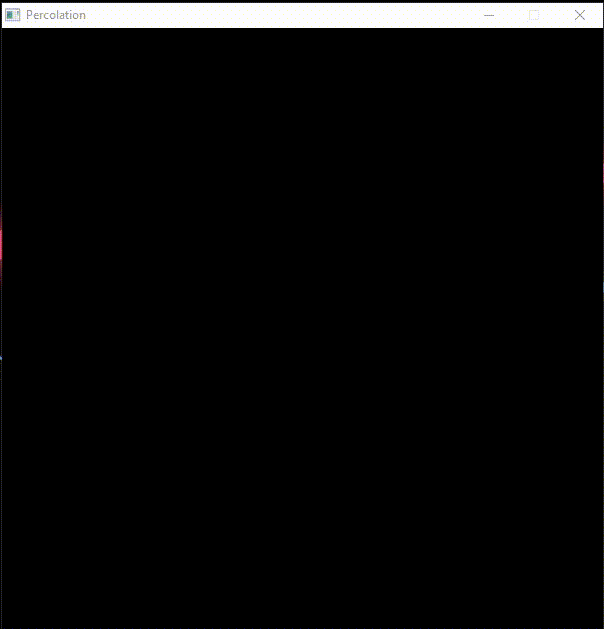

# Percolation

## What is this?

This is an implementation of the [Disjoint-set](https://en.wikipedia.org/wiki/Disjoint-set_data_structure) algorithm to check if the grid [Percolates](https://en.wikipedia.org/wiki/Percolation_theory). The program launches a GUI that allows you to poke holes in a grid, these holes will be represented as white cells. Once there is a pass through from the top to the bottom of the grid, the program will notify that the grid percolates. Diagonals do not count as a pass through.

This was a challenge provided on Week 1 of Coursera's excellent [Algorithms Part 1](https://www.coursera.org/learn/algorithms-part1) course by Robert Sedgewick. This assignment was originally in Java, but I decided to make my own UI and implementation in C.

## Setup

I have currently setup the configuration for my Windows Mingw environment. Feel free to play around to get this working for your system, and PRs are welcome!

If you are using Mingw on windows:

- Install the SDL source code for the mingw environment
- Create a `/src` folder in the root of your project
- CD into either `/i686-w64-mingw32` or `/x86_64-w64-mingw32`
- Copy the `/include` and `/lib` folders into your project's `/src` folder
- CD into the `/bin` folder of your chosen source folder
- Copy the `SDL2.dll` file into the root of your project
- Run `make` to build
- Run `make run` to run the program

## Change Grid Size

The executable takes in a grid size (width and height are equal) as arguments up to 200, you can change the argument inside the Makefile, or just when running the executable file.
